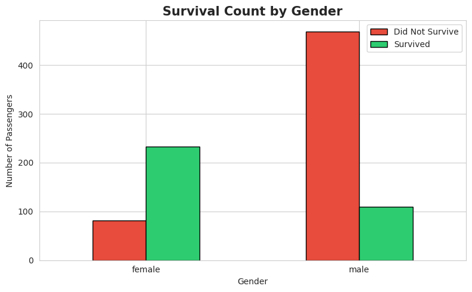
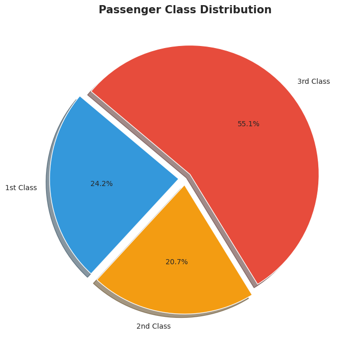
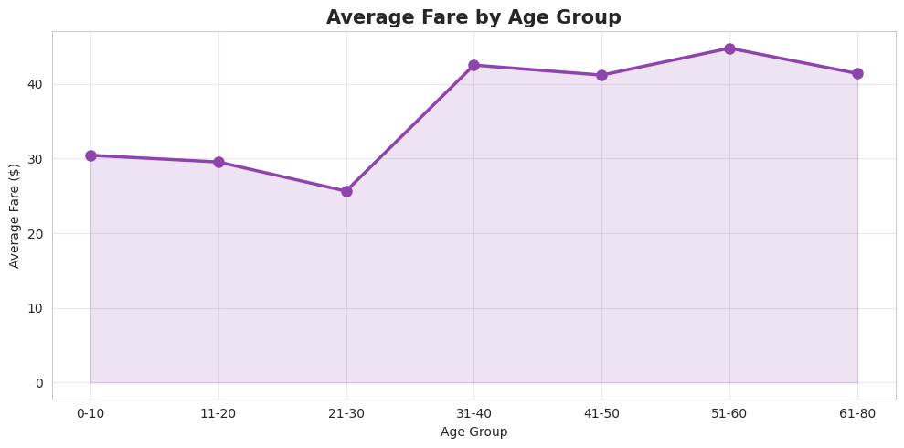

# Assignment 1 – Dataset Analysis & Data Cleaning

## 🔗 Links

- **DTT Workspace:** [https://dtt-workspace03.vercel.app/](https://dtt-workspace03.vercel.app/)

---

## Objective
Understand dataset structures and perform data preprocessing using the Titanic dataset.

---

## Project Structure

```
project/
├── analysis.ipynb
├── titanic.csv
├── requirements.txt
├── README.md
└── images/
    ├── bar_chart.png
    ├── pie_chart.png
    └── line_graph.png
```

---

## Technologies Used

| Library | Version | Purpose |
|---------|---------|---------|
| Python | 3.8+ | Programming Language |
| pandas | >=1.5.0 | Data manipulation |
| numpy | >=1.23.0 | Numerical operations |
| matplotlib | >=3.6.0 | Data visualization |
| seaborn | >=0.12.0 | Statistical plots |

- **Tool:** Google Colab / VS Code

---

## Setup & Run

**Step 1 — Install dependencies**
```bash
pip install -r requirements.txt
```

**Step 2 — Set your CSV path** (Cell 2)
```python
CSV_PATH = "titanic.csv"
```

**Step 3 — Run all cells**
- VS Code → `Kernel → Restart & Run All`
- Google Colab → `Runtime → Run All`

---

## Tasks Performed

### 1. Data Cleaning
- Loaded dataset: **891 rows × 12 columns**
- Inspected shape, column names, and data types
- Identified missing values using `isnull().sum()`

### 2. Null Value Handling

| Column | Missing Values | Action |
|--------|---------------|--------|
| Age | 177 | Filled with **median** |
| Embarked | 2 | Filled with **mode** |
| Cabin | 687 | **Dropped** (77% missing) |

### 3. Duplicate Removal
- Duplicate rows found: **0**
- Dataset shape after cleaning: **891 rows × 11 columns**

### 4. Statistical Analysis
- Overall survival rate: **38.4%**
- Survival by gender — Female: **74.2%**, Male: **18.9%**
- Survival by class — 1st: **63.0%**, 2nd: **47.3%**, 3rd: **24.2%**
- Average age: **29.36 years**
- Average fare: **32.20**

---

## Visualizations

### 1. Bar Chart – Survival Count by Gender



- Female: ~81 did not survive, ~234 survived
- Male: ~468 did not survive, ~109 survived
- Female survival rate **(74.2%)** was nearly 4x higher than male **(18.9%)**

### 2. Pie Chart – Passenger Class Distribution



- 1st Class: **24.2%**
- 2nd Class: **20.7%**
- 3rd Class: **55.1%**

### 3. Line Graph – Average Fare by Age Group



- Passengers aged **21–30** paid the lowest average fare (~25)
- Passengers aged **51–60** paid the highest average fare (~45)
- Fare generally increases after age 30

---

## Key Insights

1. Only **38.4%** of passengers survived the Titanic disaster
2. Female survival rate **(74.2%)** was nearly 4x higher than male **(18.9%)**, supporting the **"Women and Children First"** policy
3. **1st Class (63.0%)** had the highest survival rate; **3rd Class (24.2%)** had the lowest
4. More than half of all passengers **(55.1%)** were traveling in 3rd Class
5. Average passenger age was **29.36 years**, average fare was **32.20**
6. Passengers aged 51–60 paid the highest average fares (~45)

---

## Conclusion

This project demonstrates a complete data analysis pipeline — from raw CSV data to cleaned, analyzed, and visualized insights. The analysis reveals that a passenger's **gender** and **class** played the most critical role in determining their chances of survival.

---

*Dataset Source: [Kaggle – Titanic Dataset](https://www.kaggle.com/datasets/yasserh/titanic-dataset) | [Direct CSV Download](https://raw.githubusercontent.com/datasciencedojo/datasets/master/titanic.csv)*
